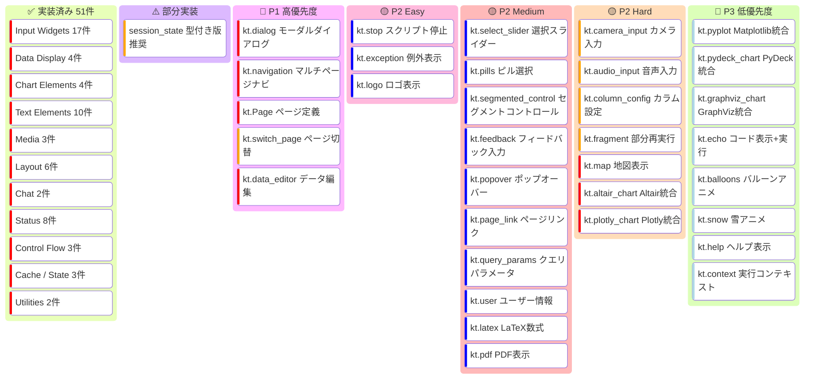
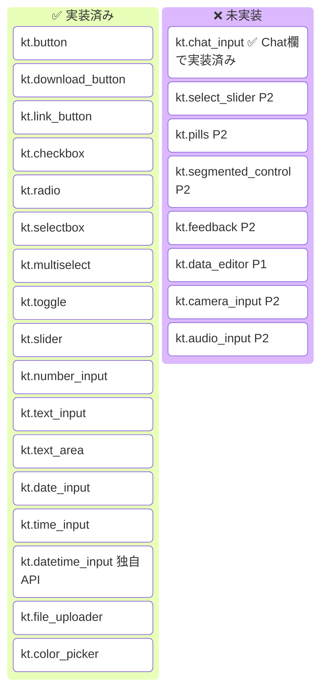
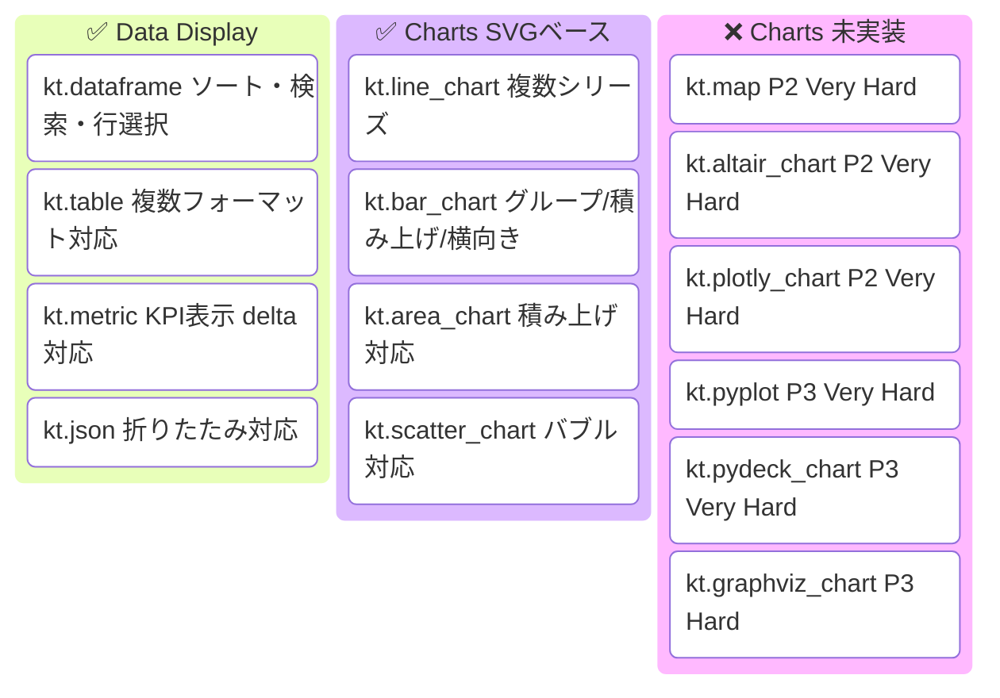
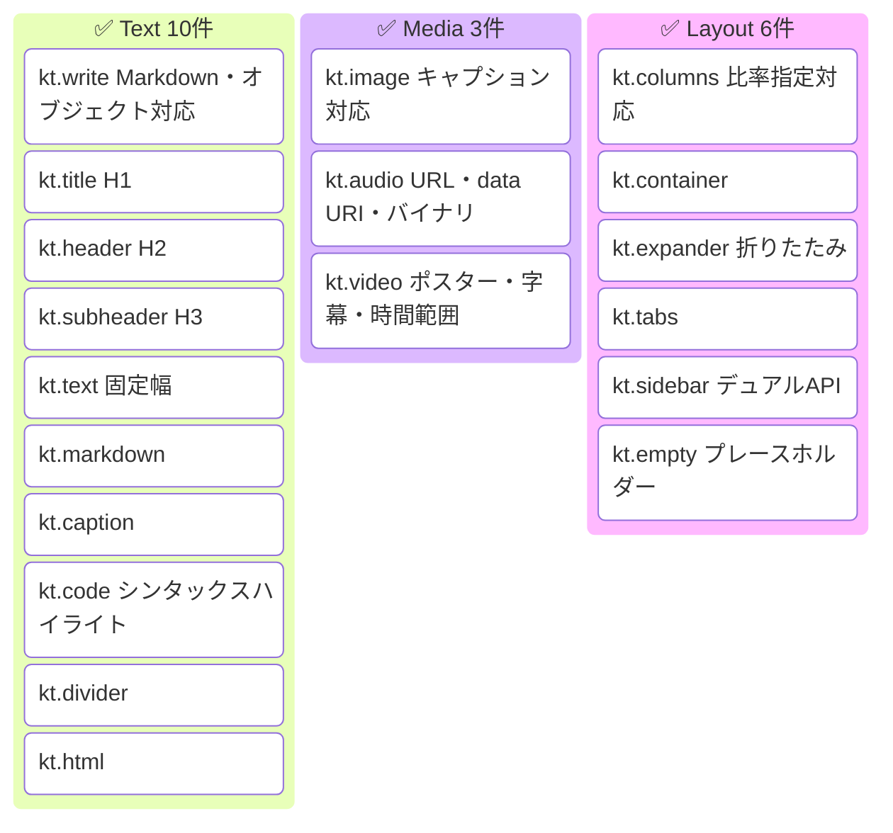
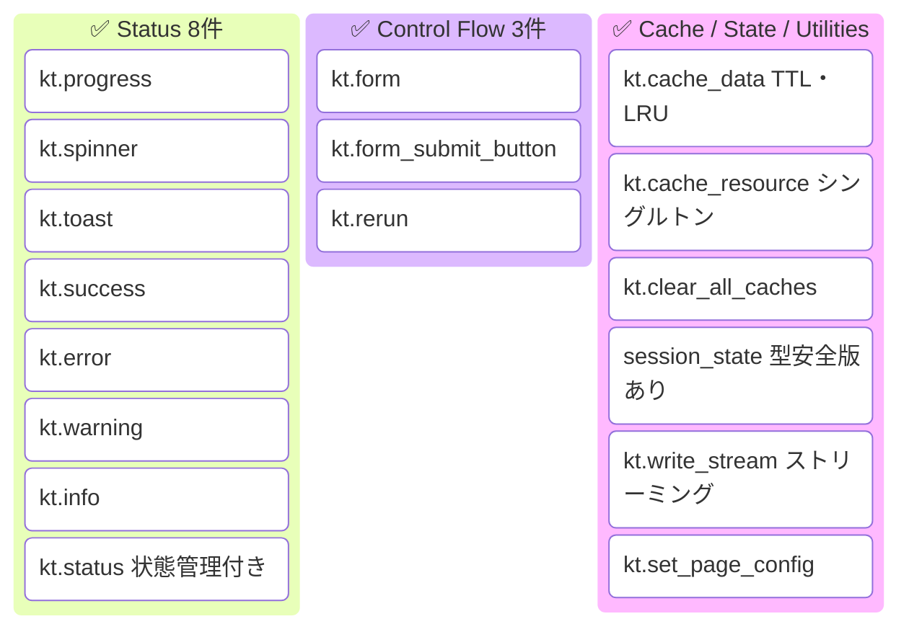
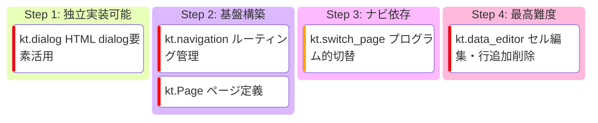

# kantan-ui API 実装状況 看板ボード

> Streamlit API との比較に基づく実装ステータスの可視化。
> 詳細は [streamlit-api-comparison.md](./streamlit-api-comparison.md) を参照。

## 看板ボード

## 実装済み API 詳細

### Input Widgets (17件)

### Data Display / Charts (8件 実装済み)

### Text / Media / Layout (19件 実装済み)

### Status / Control / Cache (16件 実装済み)

## P1 推奨実装順序

## サマリー

| カテゴリ | 実装済み | 未実装 | カバー率 |
|---------|---------|--------|---------|
| Input Widgets | 17 | 8 | 68% |
| Data Display | 4 | 1 | 80% |
| Charts | 4 | 6 | 40% |
| Text Elements | 10 | 2 | 83% |
| Media | 3 | 2 | 60% |
| Layout | 6 | 3 | 67% |
| Chat | 2 | 0 | 100% |
| Status | 8 | 3 | 73% |
| Control Flow | 3 | 2 | 60% |
| Navigation | 0 | 3 | 0% |
| Cache & State | 3 | 1 | 75% |
| Configuration | 1 | 2 | 33% |
| Utilities | 1 | 1 | 50% |
| **合計** | **51** | **29** | **64%** |

## 参考

- [Mermaid Kanban Diagram](https://mermaid.js.org/syntax/kanban.html)
- [Streamlit API Reference](https://docs.streamlit.io/develop/api-reference)
- [streamlit-api-comparison.md](./streamlit-api-comparison.md)
